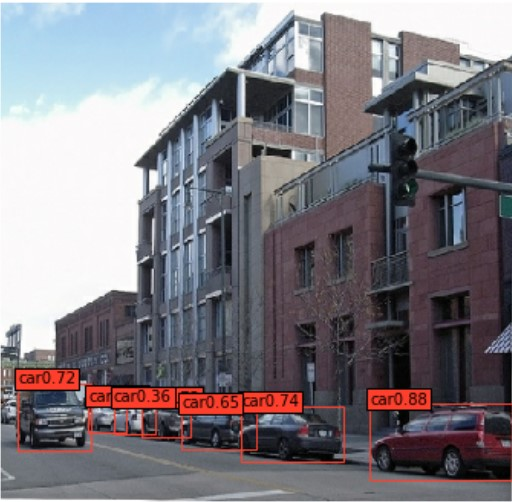
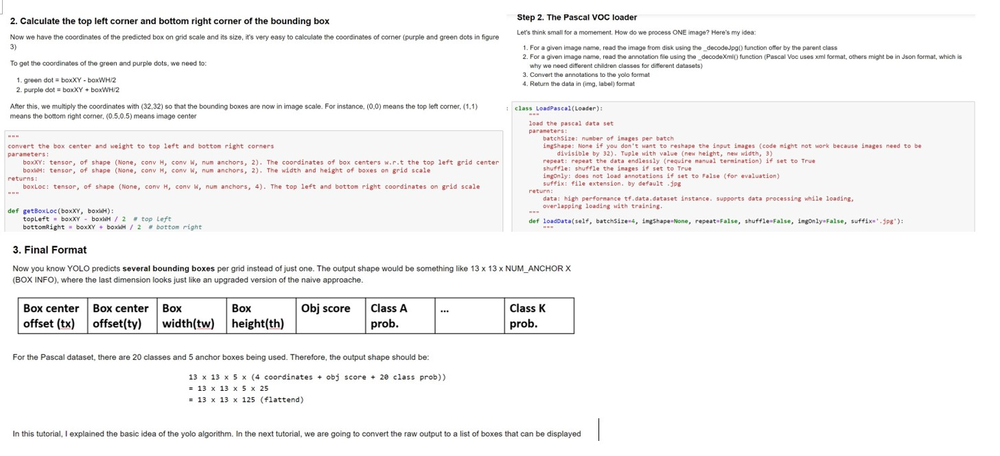

# YOLO_Explained
  

Yolo is a fully convolutional model that, unlike many other scanning detection algorithms, generates bounding boxes in one pass. 
In this tutorial repo, you'll learn how exactly does Yolo work by analyzing a Tensorflow 2
implementation of the algorithm.

## Goals 
This project has two goals: 
1. Implement Yolo 2 in native TF2 that is usable out of box using the latest API such as tf.data.Dataset and tf.keras 
2. Provide detailed explanation, examples, and charts for people who want to understand Yolo 2

Environment
<pre>
tensorflow >=2.1.0
numpy >= 1.18.5
matplotlib >= 3.1.2
</pre>

## Tutorial Structure 
#### Jupyter Notebook Tutorials  
In these tutorials we are going to implement Yolo V2 step by step 
* **Tutorial 0**: verify the environment and download some necessary weight files
* **Tutorial 1**: understand the output format of Yolo V2
* **Tutorial 2**: convert the raw yolo output to a list of bounding boxes (Post Processing)
* **Tutorial 3**: how to create training labels from annotations such as Json or XML
* **Tutorial 4**: implementation of Yolo loss 
* **Tutorial 5**: capstone - use the previous steps to do transfer learning on a new dataset 

Tutorial Snippets 

#### Python libraries Ready for Use
<pre>
root
    |Utilities
        |converter: 
            Function: convert Pascal .xml file to text and save yolo output to text
            Used to evaluate the mAP metric of Yolo V2 algorithm.
        |io:
            Functions: high performance dataloader that supports parallel loading and distributed training
        |painter:
            Functions: draw bounding boxes on images. Use for visualization 
    |YoloBackbone
        |modelBuilder: 
            Function: build Yolo V2 (or tiny yolo and other v2 variants) from .cfg file
        |yolo2:
            Function: define yolo loss, post processing scripts, etc. To understand these scripts, please 
            read the jupyter notebook tutorials
</pre>

### References 
* [Yolo 9000: Better, Faster, Stronger](https://arxiv.org/abs/1612.08242)
* [You Only Look Once: Unified, Real-Time Object Detection](https://arxiv.org/abs/1506.02640)
* [Yet Another Darknet 2 Keras](https://github.com/allanzelener/YAD2K)

